## Project: Control of a 3D Quadrotor

# Required Steps:
1. Implemented body rate control in python and C++.
2. Implement roll pitch control in python and C++.
3. Implement altitude control in python.
4. Implement altitude controller in C++.
5. Implement lateral position control in python and C++.
6. Implement yaw control in python and C++.
7. Implement calculating the motor commands given commanded thrust and moments in C++.
8. Congratulations!  Your Done!

### 1. Implemented body rate control.
The controller should be a proportional controller on body rates to commanded moments. The controller should take into account the moments of inertia of the drone when calculating the commanded moments.

The commanded roll, pitch, and yaw rotational accelerations in the body frame are obtained using a Proportional controller with form:

<p align="center">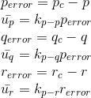</p>

We convert this rotational accelerations into Torques using the moment of inertia for roll, pitch, and yaw:

<p align="center">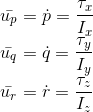</p>

### 2. Implement roll pitch control.
The controller should use the acceleration and thrust commands, in addition to the vehicle attitude to output a body rate command. 
The controller should account for the non-linear transformation from local accelerations to body rates. Note that the drone's mass should be accounted for when calculating the target angles.

The roll pitch controller uses the commanded lateral accelerations to change the drone's orientation, by commanding
roll and pitch rates pc and qc. A P controller is used to set the desired rate of change.

The commanded rotation have the form:

<p align="center">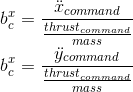</p>

The actual rotation values are the elements R13 and R23 from the rotation matrix:

<p align="center">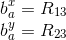</p>

The Proportional controller has the form:

<p align="center">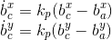</p>

Finally the values are converted into body frame angular velocities:

<p align="center">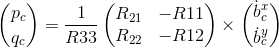</p>

### 4. Implement altitude controller.
The controller should use both the down position and the down velocity to command thrust. Ensure that the output value is indeed thrust (the drone's mass needs to be accounted for) and that the thrust includes the non-linear effects from non-zero roll/pitch angles.

Additionally, the C++ altitude controller should contain an integrator to handle the weight non-idealities presented in scenario 4.

Similar to the python altitude controller implemented in the previous step, for the c++ implementation we will be adding an Integrator term to the controller. 
This Inegrator will help to compensate the z position error originated from non accounted mass effects, e.g. a drone with a larger mass than the ideal scenarion considered by the PD controller. 
 
The controller equation has the following form:

<p align="center">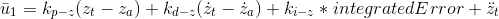</p>

where integratedError is the Z position error accumulation over small time increments dt:

<p align="center">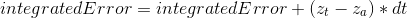</p>

Finally we transform the linear acceleration u1_hat into thrust:

<p align="center">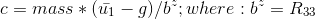</p>

From the c++ implementation we can see that the velocity is constrained into a range [-maxDescentRate, maxAscentRate] to account for a more realistic scenario.

### 5. Implement lateral position control.
The controller should use the local NE position and velocity to generate a commanded local acceleration.

Implementation of the lateral possition control is done using a PD controller with feed forward acceleration; 
notice that in the python controller the acceleration_ff term is by default a [0.0, 0,0] value, nevertheless 
the feedforward term can be useful to improve the precision of the controller if we have access to the information
of the next [x,y] commanded acceleration in advance.  

<p align="center">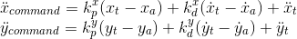</p>

The vertical velocity and acceleration are limited to maxSpeedXY and maxAccelXY, respectively, to account for a more realistic scenario.

### 6. Implement yaw control.
The controller can be a linear/proportional heading controller to yaw rate commands (non-linear transformation not required).

This is implemented as a P controller as follows:

<p align="center">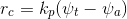</p>

The psi_error is compensated for the yaw rate command to take the shorter spin depending on the yaw_error value:

<p align="center">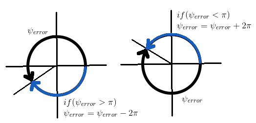</p>

### 7. Implement calculating the motor commands given commanded thrust and moments.
A drone to follow a path need to adjust the rotation rate of its propellers. We work with a Quad-copter so we need to define the thrust of each individual motors. The purpose of the controller itself is to take as input a path to follow and the measurements from the sensors, and to return a collective thrust and a set of three rotation moments along the x, y and z axis. The GenerateMotorCommands function we are implementing first, takes as input those outputs (collective thrust and rotation moments) and assign an individual thrust to the motors. The individual thrust is then converted to a rotation rate depending fo the physical properties of our propellers. At last a voltage is set for each propellers.

The thrust and moments should be converted to the appropriate 4 different desired thrust forces for the moments. 
Ensure that the dimensions of the drone are properly accounted for when calculating thrust from moments.

<p align="center">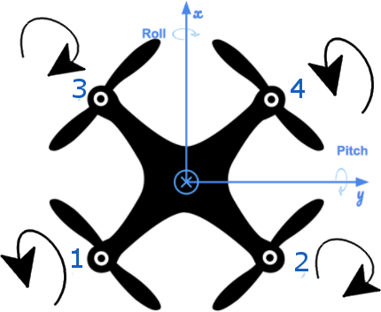</p>

From the image we see the rotation direction of each propeller, the equations for the Collective Force and Moments generated by the propellers are as follows:

<p align="center">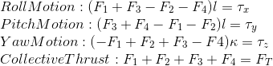</p>

Solving for F1, F2, F3, and F4:

<p align="center">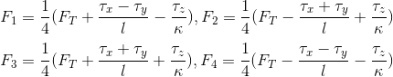</p>

In the C++ *QuadControl::GenerateMotorCommands* method are implemented as:

```
  float l = L / sqrt(2.0);

  float A = collThrustCmd;
  float B = momentCmd.x / l;
  float C = momentCmd.y / l;
  float D = momentCmd.z / kappa;

  cmd.desiredThrustsN[0] = (0.25 * (A + B + C - D)); // front left
  cmd.desiredThrustsN[1] = (0.25 * (A - B + C + D)); // front right
  cmd.desiredThrustsN[2] = (0.25 * (A + B - C + D)); // rear left
  cmd.desiredThrustsN[3] = (0.25 * (A - B - C - D)); // rear right

```

<p align="center">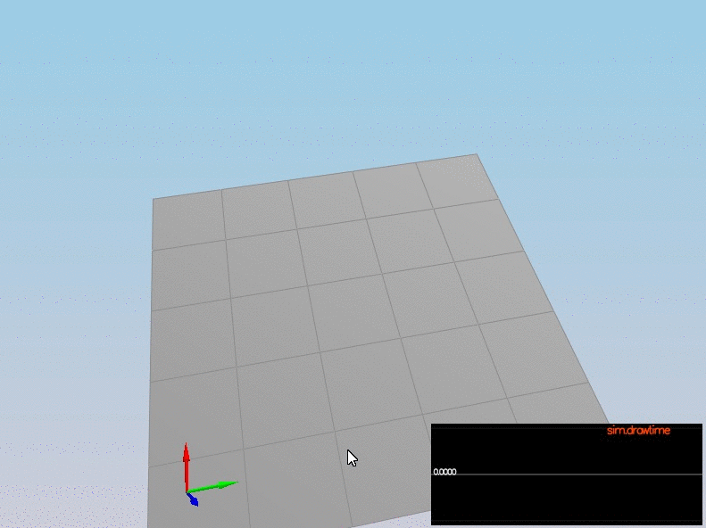</p>

### Here is a video of the final result ###

[](https://youtu.be/Kgx4ATuyZ2A "Many quadcopters simulation")
